<!-- _class: lead -->
<!-- _paginate: false -->


# 混合精度训练性能优化
Author
2021/11/26

---

## 目录

1. 混合精度训练背景知识介绍
2. 构建Tensor Cores偏爱的模型结构
3. 使用NVIDIA DALI加速数据预处理
4. 尝试开启cuDNN Exhaustive Search功能
5. 探索更多的Op融合模式
6. 充分利用梯度聚合Inplace AddTo功能
7. 探索更快的FP16训练策略

---


<!-- _class: lead -->
# 混合精度训练背景知识

---

## 1. 混合精度训练背景知识介绍

* 深度学习框架通常默认使用单精度浮点数(fp32)。然而，使用混合精度(FP32/FP16)和Tensor Cores可以实现：
  - 2-4倍的速度提升，一半的内存占用
  - 无准确率损失/无模型结构改变/无超参数改变

<center>
    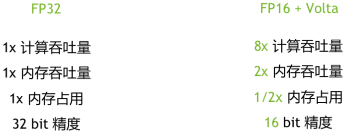
</center>

---
## 1. 混合精度训练背景知识介绍

* 既然使用FP16计算可以带来诸多好处，那为什么不将整个网络模型都转换为FP16类型计算呢？
  - 解释1：与FP32相比，FP16类型可表示的数值范围有限且数值精度较低。

<center>
    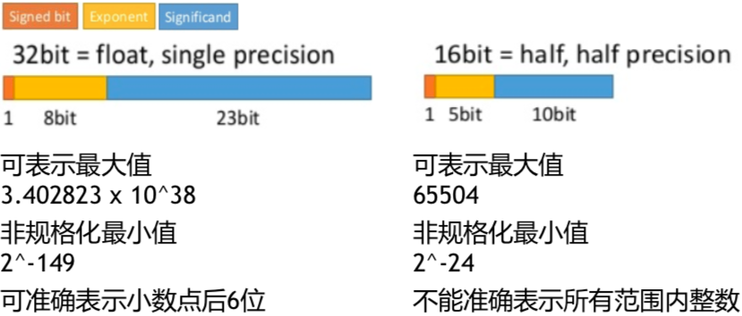
</center>

---
## 1. 混合精度训练背景知识介绍

*  <small>既然使用FP16计算可以带来诸多好处，那为什么不将整个网络模型都转换为FP16类型计算呢？</small>
   - <small>解释2：下图表示Multibox SSD模型的FP32训练中所有激活梯度量级的分布柱状图（x轴和y轴使用的均为对数表示）。由图可知，使用FP16表示会有大部分梯度值变成0。</small>

<center>
    
</center>

---
## 1. 混合精度训练背景知识介绍
**Op计算相关的FP16训练潜在问题**

* 将整个网络转换成fp16，有些数值可能最终不在FP16范围内
* 满足|f(x)| >> x 的操作应在FP32下进行
  - exp, square, log, and cross-entropy loss
* 大型的规约(reduce)应在FP32下计算
  - sum：累加很多FP16数值容易造成数据溢出
  - softmax：存在exp和sum操作，在FP16类型表示下非常容易溢出
* 其他操作在FP16下是数值稳定的
  - Conv2D, Matmul, ReLU, Sigmoid, Tanh

---
## 1. 混合精度训练背景知识介绍
**梯度更新相关的FP16训练潜在问题**
* 大数加小数造成误差
  - 梯度值 / 权重值 < $2^{-11}$，会导致更新无效
  - FP16 ： 1 + 0.0001 --> 1

* 不准确的权值更新
  - 梯度太小导致下溢为0（详见第6页PPT）

---
## 1. 混合精度训练背景知识介绍

**混合精度训练解决方案**

<center>
    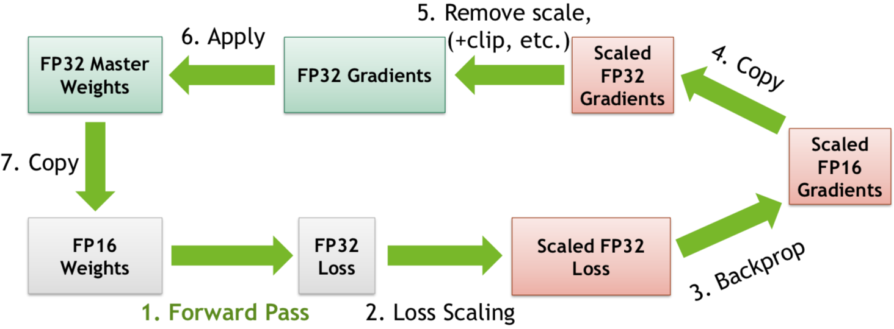
</center>

<font color=red size=5 face="Comic sans MS">说明：Paddle中AMP的实现方案详见[AMP设计文档](http://agroup.baidu.com/paddlepaddle/md/article/2137911)。</font>

---


<!-- _class: lead -->
# 混合精度训练性能优化

---


## 2. 构建Tensor Cores偏爱的模型结构
**NHWC数据布局影响**
* conv2d/batch_norm/pool2d等网络层需要将数据布局设置为NHWC，这样可加快Tensor Cores的计算过程，[示例](https://github.com/PaddlePaddle/models/pull/4185/files)。
<center>
    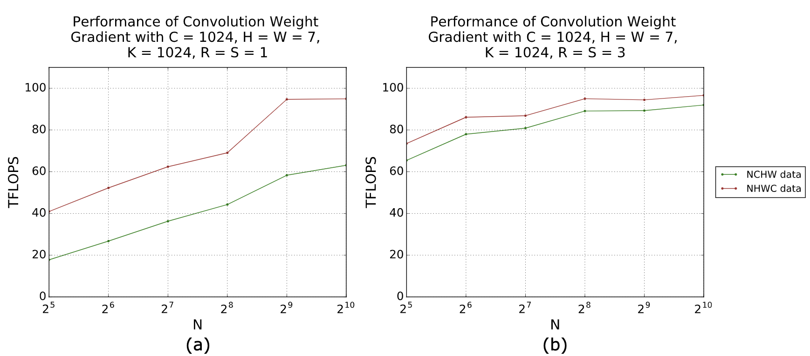
</center>

---

## 2. 构建Tensor Cores偏爱的模型结构
**利用stop_gradient进行反向计算剪枝**

* 在设置conv2d等网络层的数据布局为`NHWC`后，读入的图像数据（`NCHW`）会被transpose算子进行转换。因为梯度反向传播过程中不需要计算feed数据的梯度，因此我们可以将transpose op输出Var的stop_gradient属性设置为true，这样通常可以减少一个conv2d_grad的计算过程（针对CV类模型），[示例](https://github.com/PaddlePaddle/models/pull/4831/files)。
<center>
    nhwc" />
</center>

---

## 2. 构建Tensor Cores偏爱的模型结构
<br/>

<div style="overflow: hidden;">
   <div style="float: left; width: 50%;">
      <div>
        <b>输入/输出通道数对卷积运算的影响</b>
      </div>
      <div>
        <ul>
          <li> Tensor Cores要求在使用FP16加速卷积运算时需将输入/输出通道数设为8的倍数，这样可获得最佳运算性能。
          <li> 对于网络的第一层，图片通道数设置为4可获得更佳的运算性能（NV为网络第一层卷积提供了一个特殊的实现，cuDNN版本低于7.6.3时使用4通道输入而非3通道输入性能提升更为明显），<a href="https://github.com/PaddlePaddle/models/pull/4911/files">示例</a>。
        </ul>
      </div>
   </div>
   <div style="float:left; width: 50%;">
      <div>
      </div>
      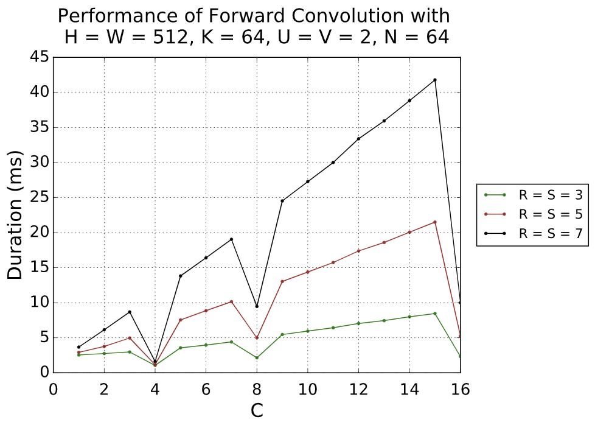
   </div>
</div>

---

## 2. 构建Tensor Cores偏爱的模型结构
**M/N/K尺寸对矩阵乘法的影响**
* Tensor Cores要求在使用FP16加速矩阵乘运算时矩阵行数和列数均为8的倍数，这样可获得最佳运算性能。

<table style="margin: 0px auto;" cellpadding="0" cellspacing="0" frame="void">
    <tr>
        <td>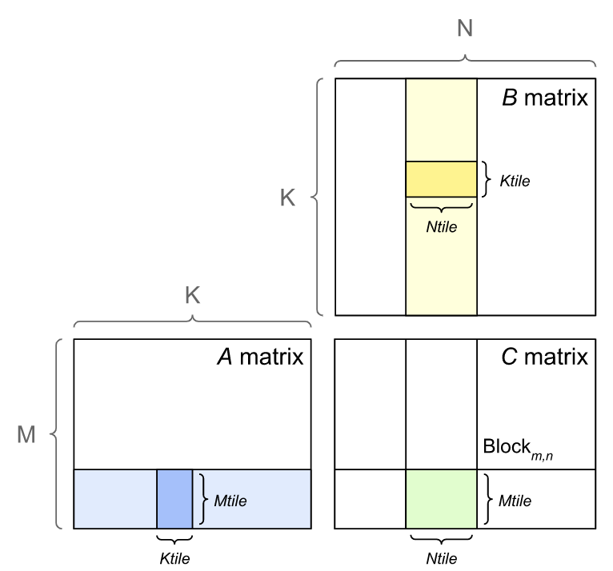</td>
        <td>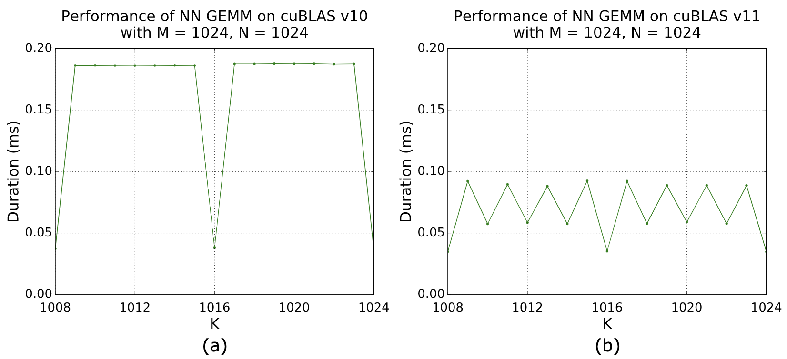</td>
    </tr>
</table>


---

## 2. 构建Tensor Cores偏爱的模型结构
**M/N/K尺寸对矩阵乘法的影响**

* 不同版本cuBLAS/cuDNN库对矩阵维度M/N/K的要求如下表所示。

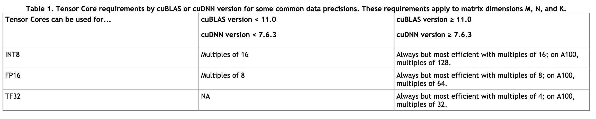

---

## 3. 使用NVIDIA DALI加速数据预处理

* 使用nvidia-dali将一些CPU上的数据预处理操作放到GPU上去处理，可以大幅提高训练的效率。
* 在模型训练遇到IO瓶颈时启用dali会有明显的性能提升，但dali会占用一部分显存。因此，一般设置使用dali后需要控制Paddle对显存对占用，即设置`FLAGS_fraction_of_gpu_memory_to_use=0.8`。
* Paddle模型训练启动dali预处理的相关PR详见[示例](https://github.com/PaddlePaddle/models/pull/3960/files)。

<center>
    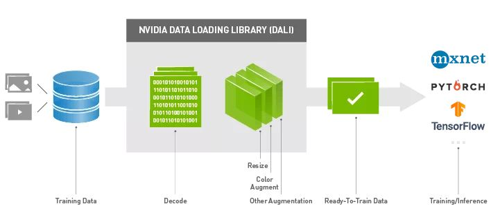
</center>

---

## 4. 尝试开启cuDNN Exhaustive Search功能
* 设置如下环境变量可开启cuDNN Exhaustive Search功能。

```bash
# The workspace limit size in MB unit for choosing cuDNN convolution algorithms.
export FLAGS_conv_workspace_size_limit=4000

# Whether to use exhaustive search method to choose convolution algorithms.
# There are two search methods, heuristic search and exhaustive search in cuDNN. 
export FLAGS_cudnn_exhaustive_search=1
```

<font color="#2874A6" size=5>在优化ResNet50模型混合精度训练时，将输入设置为4通道开始时没有效果，之后修改了search策略，性能可提升6.4%，详见[示例](https://github.com/PaddlePaddle/Paddle/pull/27529/files)。</font>

<font color=red size=5 face="Comic sans MS">注意：开启cuDNN Exhaustive Search功能也可能降低性能，故而此处说的是“尝试开启”。</font>

---

## 5. 探索更多的Op融合模式

* Op融合技术可加速Op的计算过程，其原理阐述如下：
    - 将多个小Op融合成一个大Op，可以节省内(显)存/提高访问效率/减少访问次数/减少Kernel的Launch次数/降低通信量等。
    - 可以使用cuDNN提供的一些融合API以提高计算速度。
* Op融合只可谓之“器”而非“道”，主要是因为Op融合仅在其要求的计算pattern匹配到时才有加速效果。
<center>
    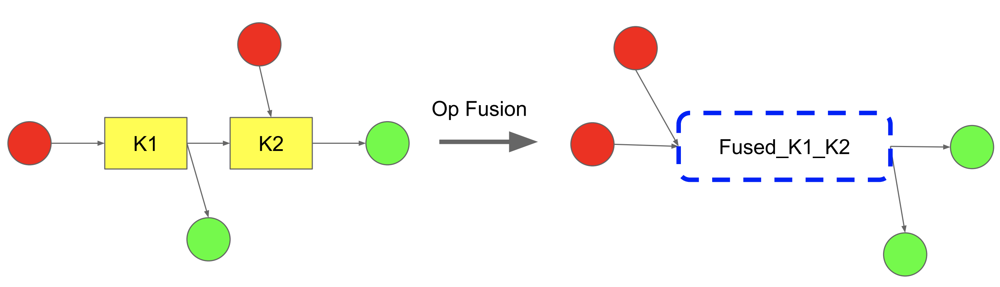
    <br/>
    <small>Op融合示例图</small>
</center>

---

## 5. 探索更多的Op融合模式

**与AMP框架策略相关的Op融合（默认开启）**
* 使用AMP策略并开启动态loss scaling功能会引入额外的梯度有效性检查、梯度缩放以及Good/Bad反向回传步数更新操作等相关算子的开销（overhead）。
* 之前AMP策略引入的算子均是使用python层layer进行组合的（比如`layers.reduce_sum`、`layers.concat`以及`layers.isfinite`等），若干小Op组成的功能效率不但低下而且还引入了不少`condition block`。
* 现在这部分代码已完成重构，即按照功能分成`check_finite_and_unscale`和`update_loss_scaling`两个Op，并分别在底层使用C++和CUDA进行了编码实现。详见[# PR26240](https://github.com/PaddlePaddle/Paddle/pull/26240/files)。
* 修改后ResNet50模型AMP训练性能可提升3.47%，并且框架层的修改会对使用AMP动态loss scaling功能的所有模型训练均有加速效果。

---

## 5. 探索更多的Op融合模式
**与Weight Decay相关的Op融合（针对优化器的融合）**
* Paddle中的Weight Decay均在Python层实现，即在计算出梯度后再launch新的cuda kenrnel完成Weight Decay操作。
* Weight Decay操作完全可以在梯度计算kernel中同时完成，这样可以减少cuda launch数以及访存数，`Momentum + L2 WeightDecay`融合Op的实现详见[# PR27414](https://github.com/PaddlePaddle/Paddle/pull/27414/files)。
* 目前仅在`Momentum`优化器中融合了`L2 WeightDecay`，如果是使用其他的优化器，可考虑将`WeightDeacy`操作进行相应融合。

---

## 5. 探索更多的Op融合模式
**与Batch Normalization有关的算子融合（主要针对CV类模型）**

* 在ResNet50混合精度训练中主要使用了`batch_norm+relu`以及`batch_norm+add+relu`的融合，具体实现详见[bn+relu](https://github.com/PaddlePaddle/Paddle/pull/22048/files)、[bn+add+relu op](https://github.com/PaddlePaddle/Paddle/pull/27230/files)和[bn+add+relu pass](https://github.com/PaddlePaddle/Paddle/pull/28196/files).

* 启用`batch_norm+relu`以及`batch_norm+add+relu`的融合需要如下步骤：
    - 设置环境变量`FLAGS_cudnn_batchnorm_spatial_persistent=1`以启用cuDNN新的batch_norm计算模式。
    - 设置[fluid.compiler.BuildStrategy](https://www.paddlepaddle.org.cn/documentation/docs/zh/api_cn/fluid_cn/BuildStrategy_cn.html#buildstrategy)类对象的`fuse_bn_act_ops`和`fuse_bn_add_act_ops`属性值为True，详见[示例](https://github.com/PaddlePaddle/models/blob/develop/PaddleCV/image_classification/utils/utility.py#L534)。
    * <font color=red size=5 face="Comic sans MS">说明：开启`batch_norm+relu`以及`batch_norm+add+relu`的融合可有效加速ResNet50的AMP训练性能（加速10%以上）。</font>

---

## 5. 探索更多的Op融合模式
**可尝试开启的其他Op融合选项**

* 类似地，我们可以选择开启`fuse_all_optimizer_ops`、`fuse_elewise_add_act_ops`以及`enable_auto_fusion`等Op融合策略，它们都是`fluid.compiler.BuildStrategy`类对象的属性，设置其值为True即为开启。
    - <font color=#2874A6>fuse_all_optimizer_ops</font>：对模型中的参数更新操作进行融合。
    - <font color=#2874A6>fuse_elewise_add_act_ops</font>：对模型中的`elementwise_add`和`relu`算子进行融合。
    - <font color=#2874A6>enable_auto_fusion</font>：开启`auto_fusion`选项可对符合条件的小Op进行自动融合。


---

## 6. 充分利用梯度聚合Inplace AddTo功能
* 下图展示了反向计算过程所需的梯度聚合操作。即若一个Var的梯度是由多个反向Op产生的，则需要对所有的分量梯度进行sum求和操作。

<center>
    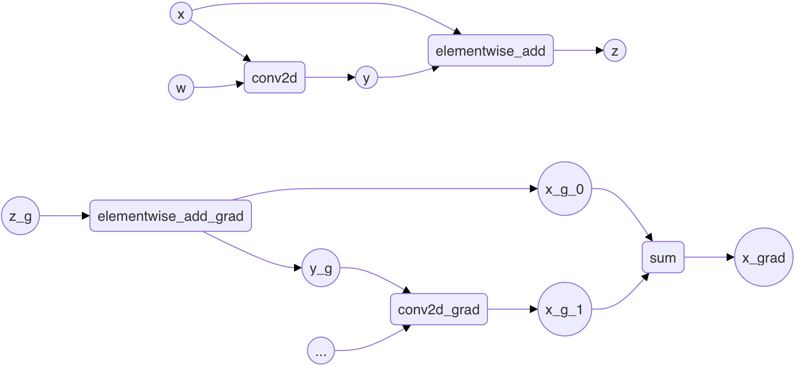
</center>

---

## 6. 充分利用梯度聚合Inplace AddTo功能
<center>
    
    <br/>
    <small>将sum梯度聚合方式改成AddTo模式</small>
</center>

---

## 6. 充分利用梯度聚合Inplace AddTo功能
<center>
    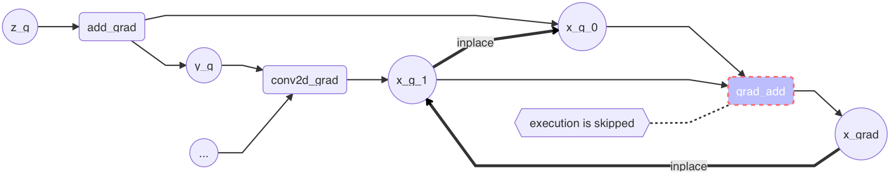
    <br/>
    <small>Inplace AddTo操作流程示意图</small>
</center>

* <small>如上图所示Inplace AddTo功能会将`conv2d_grad`的输出$x_g_1$与$x_g_0$进行`inplace`操作，这样在进行`conv2d_grad`操作时可以借助[cudnnConvolutionBackwardData](https://docs.nvidia.com/deeplearning/cudnn/api/index.html#cudnnConvolutionBackwardData)提供的$dst\_value = \alpha \times result + \beta \times prior\_dst\_value$操作进行梯度聚合。$prior\_dst\_value$即add计算得到的$x_g_0$，$dst\_value$即为$x_{grad}$，设置$\alpha$和$\beta$的值均为1，则con2d_grad计算得到的梯度$x_g_1$($result$)就会累加到$x_g_0$($prior\_dst\_value$)上。详细代码实现见[# PR27112](https://github.com/PaddlePaddle/Paddle/pull/27112)，竞品实现详见[# MxNet PR3470](https://github.com/apache/incubator-mxnet/pull/3470)。</small>

---
## 6. 充分利用梯度聚合Inplace AddTo功能
**开启梯度聚合Inplace AddTo功能的方法**

* 模型训练时开启梯度聚合Inplace AddTo功能需要执行如下两步：
  - 设置`FLAGS_max_inplace_grad_add`为一个正数（比如8），其表示如果需要聚合的梯度数小于8，Inplace AddTo功能才会开启。这主要是因为Inplace AddTo功能理论上会影响程序运行的并发度。上图中$x_g_1$ inplace $x_g_0$，$x_{grad}$ inplace $x_g_1$，在三个变量的计算顺序是$x_g_0$ -> $x_g_1$ -> $x_{grad}$。
  - 与启用`batch_norm+relu`等Op融合类似，开启梯度聚合Inplace AddTo功能还需要设置`fluid.compiler.BuildStrategy`类对象的`enable_addto`属性值为True，详见[示例](https://github.com/PaddlePaddle/models/blob/develop/PaddleCV/image_classification/utils/utility.py#L548)。

---

## 7. 探索更快的FP16训练策略

**预备知识——[Apex](https://github.com/NVIDIA/apex)不同[优化级别](https://nvidia.github.io/apex/amp.html)的FP16训练特征**

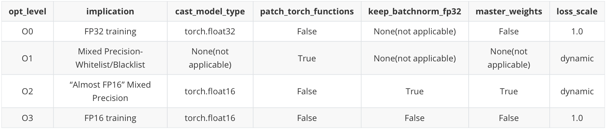

* <font color=red size=5 face="Comic sans MS">Apex是一款由Nvidia开发且基于PyTorch的混合精度训练工具。</font>
* <font color=red size=5 face="Comic sans MS">cast_model_type: Casts your model’s parameters and buffers to the desired type.</font>
* <font color=red size=5 face="Comic sans MS">patch_torch_functions: Patch all Torch functions and Tensor methods to cast their inputs according to a whitelist-blacklist model. </font>

---

## 7. 探索更快的FP16训练策略
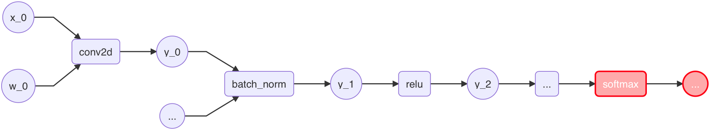
* Paddle框架中前期实现的AMP策略是根据黑白名单在相应位置插入`cast`算子，简记<font color=red size=5 face="Comic sans MS">FP16-AMP</font>。该策略可能会引入过多的`cast`开销且未满足条件的Op依然使用FP32计算。
* 分析[apex](https://nvidia.github.io/apex/amp.html#opt-levels) O2优化等级以及[NVIDIA DeepLearningExamples](https://github.com/NVIDIA/DeepLearningExamples/tree/master/MxNet/Classification/RN50v1.5)中的ResNet50 FP16训练行为，现已为Paddle进一步开发了对应`apex O2`优化等级的<font color=red size=5 face="Comic sans MS">FP16-O2</font>策略。

---
## 7. 探索更快的FP16训练策略

<center>
    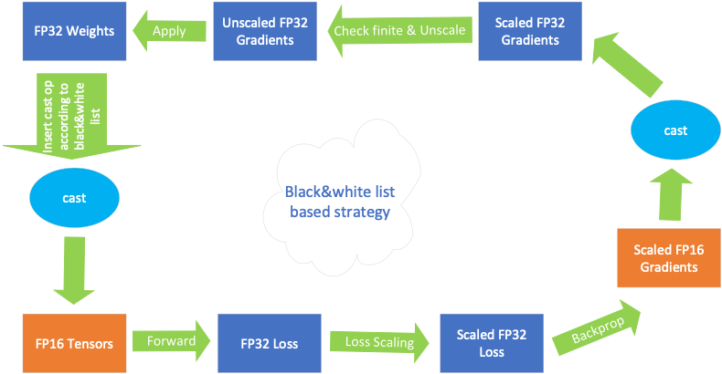
    <br/>
    <small>基于黑白名单策略(FP16-AMP)的AMP功能原理</small>
</center>

---
## 7. 探索更快的FP16训练策略

<center>
    
    <br/>
    <small>基于纯FP16训练策略(FP16-O2)的AMP功能原理</small>
</center>

---

## 7. 探索更快的FP16训练策略

**FP16-O2策略实现要点——功能设计**
* 提供`cast_net_to_fp16`功能，用户构建网络时可选择使用该接口在数据流达到`softmax` Op前将网络cast成FP16类型。
* 提供`cast_parameters_to_fp16`功能，用于在执行`exe.run(startup_program)`初始化模型参数后将参数类型cast成FP16类型。
  - 原因：Paddle中存在一些生成随机数的Op不支持或不能很好地支持FP16数据类型参数的初始化。
* <font color=red size=5>注意：上述两个接口会对与`batch_norm`有关的Op进行特殊处理，即仅转换`batch_norm`的输入(X)和输出(Y)为FP16类型，保持其他输入/输出为FP32类型，否则将影响网络模型的收敛性。</font>

---

## 7. 探索更快的FP16训练策略

**FP16-O2策略实现要点——优化器相关支持**
* 为保证模型使用FP16-O2策略可以正常收敛，优化器中需要做如下改动：
  - 为优化器提供`multi_precision`属性，该属性控制是否在优化器中针对FP16类型参数保存一份相对应的FP32类型<font color=red size=5 face="Comic sans MS">master weights</font>。`O2`级别FP16训练推荐设置`multi_precision`属性值为True，以保证模型的收敛性。
  - <font color=red size=5 face="Comic sans MS">master weights</font>会一并作为优化器的输入和输出（可将它们设置为Dispensable）。
  - 优化器更新权重时若发现输入中存在<font color=red size=5 face="Comic sans MS">master weight</font>，则使用<font color=red size=5 face="Comic sans MS">master weight</font>和梯度（类型会先提升至FP32类型）计算新的权重值。而新的权重值会同时赋值给FP16权重及其对应的<font color=red size=5 face="Comic sans MS">master weight</font>。

---
## 7. 探索更快的FP16训练策略

**FP16-O2策略训练阶段正常，验证阶段正常(ResNet50)✅**

<table style="margin: 0px auto;" cellpadding="0" cellspacing="0" frame="void">
    <tr>
        <td>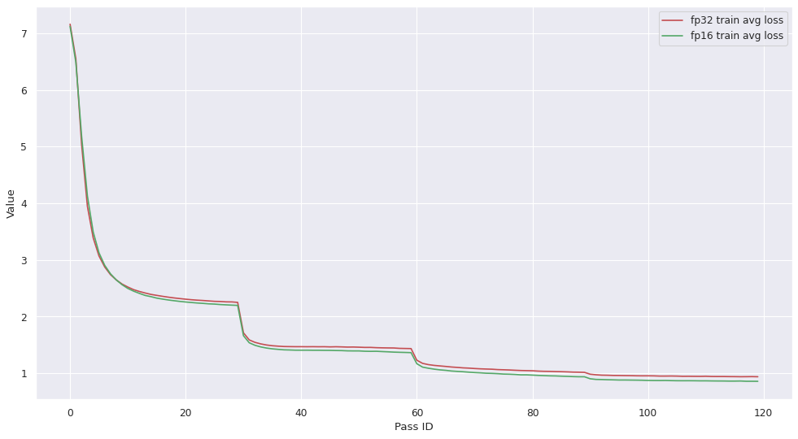</td>
        <td></td>
    </tr>
    <tr>
        <td>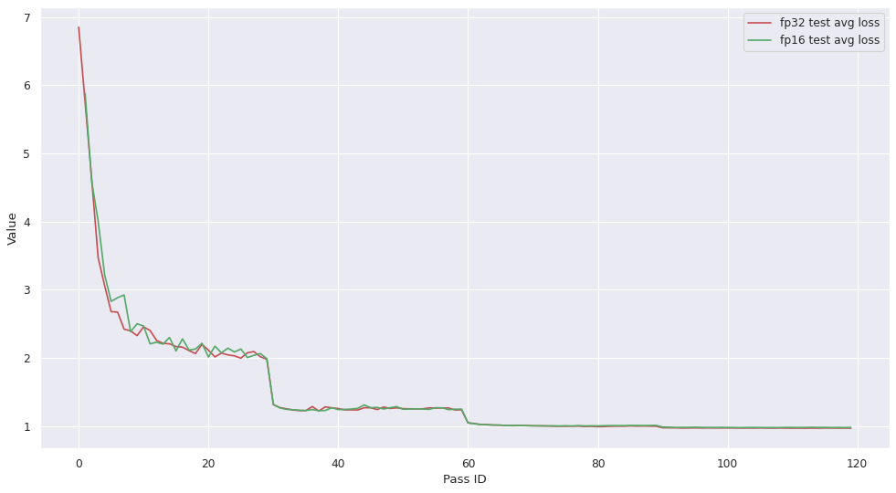</td>
        <td>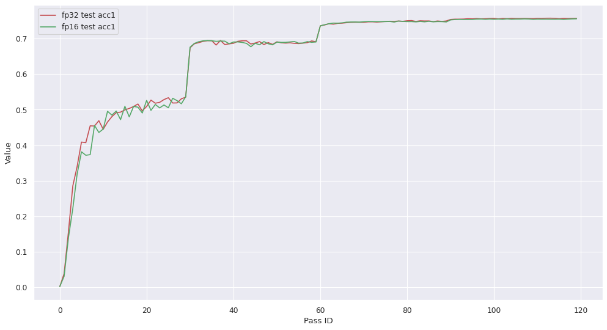</td>
    </tr>
</table>

---
## 7. 探索更快的FP16训练策略

**FP16-O2策略训练ResNet50模型的性能**

* 机器配置： Intel 6148 CPU 2.40GHz 40核; Tesla V100-SXM2-16GB GPU
* <font color="red"> Speed Uint: images / sec </font>

|Batch Size | FP16-AMP | FP16-O2 | Speedup | 
|:---:|:---:|:---:|:---:|
|128 | 1240.96 | 1341.71 | 1.081 | 
|208 | 1341.62 | 1417.59 | 1.057 |

---
## 参考资料

* [Paddle AMP设计文档](http://agroup.baidu.com/paddlepaddle/md/article/2137911)

* [MIXED PRECISION TRAINING](https://arxiv.org/pdf/1710.03740.pdf)

* [NVIDIA TENSOR CORES](https://www.nvidia.com/en-us/data-center/tensor-cores/)
* [Tensor Layouts In Memory: NCHW vs NHWC](https://docs.nvidia.com/deeplearning/performance/dl-performance-convolutional/index.html#tensor-layout)
* [Matrix-Matrix Multiplication Requirements](https://docs.nvidia.com/deeplearning/performance/dl-performance-matrix-multiplication/index.html#requirements-tc)
* [The opt_levels of Apex AMP](https://nvidia.github.io/apex/amp.html#opt-levels)
* [NVIDIA DeepLearningExamples](https://github.com/NVIDIA/DeepLearningExamples/tree/master/MxNet/Classification/RN50v1.5)
* [Comparing bfloat16 range and precision to other 16-bit numbers](https://www.johndcook.com/blog/2018/11/15/bfloat16/)

---
